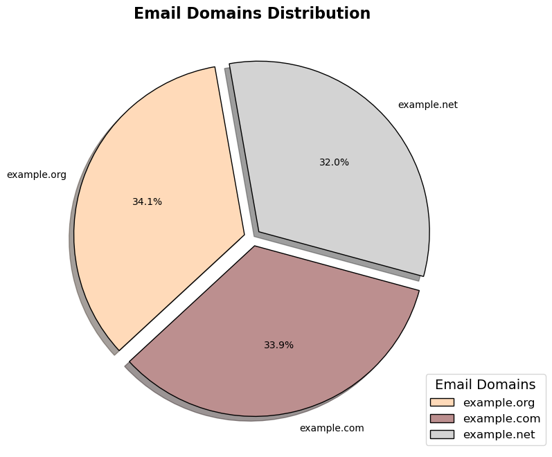
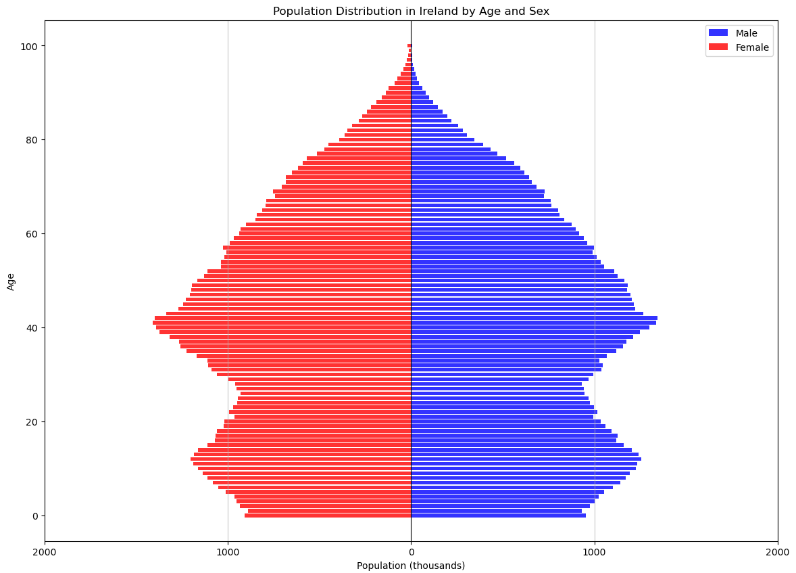
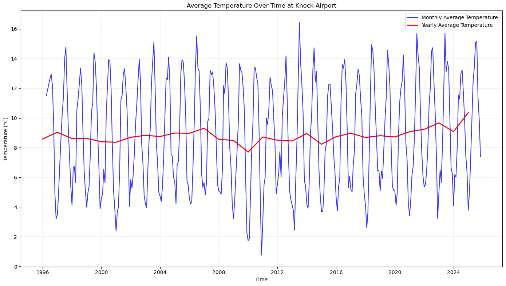

#  **Programming for Data Analytics📊**

👤 Author: Mariane McGrath

## Overview 🌇

This repository contains four distinct data analysis projects demonstrating skills in Python programming, data visualisation, and statistical analysis using Jupyter notebooks and Python scripts.

## **Usage Instructions: 🚀**

1. **Grab the code:**

-   git clone https://github.com/marianemcgrath/pfda

2. **Select Folder**

-   "assignments/"

3. **Install your tools:**

-   Check requirements.txt file

## In the folder, you will find...

### 🎉 Assignment: Bank Holidays

**File:** `assignment02_bankholidays.py`

**🎯 Objectives:**

*   **Primary Task:** Print all bank holiday dates for Northern Ireland

*   **Advanced Task:**  Identify holidays which are unique to Northern Ireland

#### 🔧 Key Features:
*   Retrieves and processes data
*   Filters unique Northern Ireland holidays

[Go to Assignment: Bank Holidays](https://github.com/marianemcgrath/pfda/blob/main/assignment/assignment02_bankholidays.py)

### 📧 Assignment: Email Domains

**Notebook:** `assignment03_pie_redo.ipynb`

**🎯 Objectives:**
*   **Task:** Analyse email addresses from CSV file and create a pie chart for the email domain distribution

*   **Data Source:** [1000 Email Addresses](https://drive.google.com/uc?id=1AWPf-pJodJKeHsARQK_RHiNsE8fjPCVK&export=download)

#### 📊 **Analytical Methods:**

*   Data loading from cloud sources

*   Pandas data manipulation

*   Matplotlib/Seaborn visualisation - pie chart design

*   Data cleaning and preprocessing

[Go to Assignment: Email Domains](https://github.com/marianemcgrath/pfda/blob/main/assignment/assignment03_pie_redo.ipynb)

### 👥 Assignment: Population Insights

**Notebook:** `assignment05-population.ipynb`

**Tasks:**

🎯 Part 1: Sex-Based Age Analysis: Calculate weighted mean age by sex, analyse age distribution differences between sexes, national analysis (excluding regional breakdown)

🎯 Part 2: Age Group Analysis, implement dynamic age grouping (±5 years around specified age), calculate population differences between sexes within age groups

*   Variable-driven analysis (age 35)

🎯 Part 3: Identify region with largest sex-based population difference, focus on specified age group from Part 2, regional comparison across Ireland

#### 📊 **Analytical Methods:**

*   Statistical aggregation

*   Age group binning

*   Comparative analysis

*   Regional segmentation

[Go to Assignment: Population Insights](https://github.com/marianemcgrath/pfda/blob/main/assignment/assignment05_population.ipynb)

### 🌤️ Assignment: Knock Airport Weather Analysis

**Notebook:** `assignment05_weather.ipynb`

**Tasks:**

*   📈 Part 1: Temperature time series, daily and monthly mean temperatures, labeled and formatted plots

*   📈 Part 2: Windspeed visualisation (handling missing data), 24-hour rolling average windspeed, daily maximum windspeed, monthly mean of daily maximum windspeeds

🌐 **Data Source:** [Knock Airport Weather](https://cli.fusio.net/cli/climate_data/webdata/hly4935.csv)

#### 📊 Analytical Methods:

-   Missing data handling and formatting

-   Time series resampling

-   Rolling statistics calculation

-   Multi-plot visualisation

[Go to Assignment: Knock Airport Weather](https://github.com/marianemcgrath/pfda/blob/main/assignment/assignment06_weather.ipynb)

## 🛠️ **Technical Stack**

**Languages & Libraries:**

*   **Python 3.x**

*   **Pandas** – Data manipulation and analysis

*   **NumPy** – Numerical computations

*   **Matplotlib/Seaborn** – Data visualisation

*   **Jupyter Notebooks** – Interactive development

## **References:**

**The main sources used were:**

[GeeksforGeeks] (https://www.geeksforgeeks.org/)

[Stack Overflow*](https://stackoverflow.com/)

[W3Schools] (https://www.w3schools.com/)

[Pandas Documentation](https://pandas.pydata.org/docs/)

[Real Python](https://realpython.com/)

[DataCamp] (https://www.datacamp.com/)

All code in the assignment folder has been referenced and including AI prompts when required.

**Population distribution graph was created by the author of this project (because I really wanted to create a pyramid plot, and used it as my Christmas wish!).

Using [Stack Overflow](https://stackoverflow.com/questions/63619776/population-pyramid-with-python-and-seaborn_), [Medium](https://maciejtarsa.medium.com/plotting-a-population-pyramid-in-python-52be034968b0), [CodersColumn](https://coderzcolumn.com/tutorials/data-science/population-pyramid-chart-using-matplotlib) and beautified with the help of Claude AI.

---

*Made with ❤️, 😭, and probably too much coffee ☕*